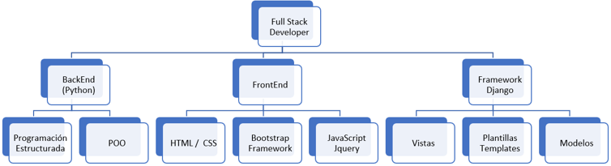
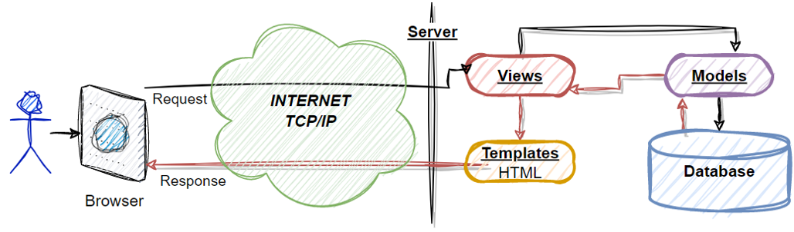

# Python - Full Stack Developer

# Tabla de contenido 
1. [Objetivo general](#objective)
2. [Competencias a desarrollar](#skills)
3. [Roadmap](#roadmap)
4. [¿Por qué python?](#why_python)
5. [¿Por qué Django?](#why_django)
6. [Referencias](docs/References.md)
7. [Modulo 1 - Programación estructurada](docs/Modulo-I/Modulo-I-Index.md)
8. [Modulo 2 - POO](docs/Modulo-II/Modulo-II-Index.md)
9. [Modulo 3 - HTML5, CSS, JS, Jquery](docs/Modulo-III/Modulo-III-Index.md)
10. [Modulo 4 - Bootstrap](docs/Modulo-IV/Modulo-IV-Index.md)
11. [Modulo 5 - Django - MVT](docs/Modulo-V/Modulo-V-Index.md)
12. [Modulo 6 - Django, Vistas Basadas en Clases](docs/Modulo-VI/Modulo-VI-Index.md)
13. [Modulo 7 - Temas selectos](docs/Modulo-VII/Modulo-VII-Index.md)
14. [Referencias](docs/References.md)
15. [Preguntas frecuentes](docs/FAQ.md)

## Objetivo general 
Adquirir las habilidades que se requieren para tener el perfil de **full stack developer** es decir, tener los conocimientos necesarios para la creación de aplicaciones web, desarrolladas en un tiempo óptimo y de manera sencilla. Proyectar al profesionista como un agente de cambio dentro de su organización, mediante el desarrollo tecnológico y soluciones creativas e innovadoras basadas en el desarrollo web.

## Competencias a desarrollar 
* Resolución de problemas
* Pensamiento analítico
* Creatividad e innovación

## Roadmap  
  
### Django FrameWork - Modelo Vista Template
  
#### Vistas 
* Clases o funciones que atienden las peticiones HTTP
* Funciones y Clases en python
#### Modelos 
* ORM (Object Relational Maping)
* Escalable para cualquier manejador de bases de datos
#### Templates 
* Sitios responsviso 
* HTML (plantillas) -> Herencia -> Template tags 
* CSS & Bootstrap
* JavaScript, Jquery, JSON, AJAX 

## ¿Por qué python? 
Existen muchas razones por las cuales debes aprender Python, primeramente porque es **popular**, ¿qué ventajas tiene un lenguaje de programación popular?, significa que es un lenguaje de alto nivel que día a día va teniendo mejoras en todos los sentidos, conforme vayas avanzando en el curso, te darás cuenta que "sabe más python" quien conoce más librerías, acá te dejo algunas otras ventajas. 
### Sintaxis clara y legible
Python tiene una sintaxis limpia y legible que hace que el código sea fácil de entender y mantener. Esto lo convierte en un lenguaje ideal para proyectos grandes y complejos.
### Amplia biblioteca estándar
Python cuenta con una amplia biblioteca estándar que cubre una amplia gama de áreas, desde el procesamiento de texto y la manipulación de datos hasta la creación de interfaces gráficas de usuario y el desarrollo web. Esto significa que los programadores pueden ahorrar tiempo y esfuerzo al no tener que escribir todo desde cero, python lo encuentras en varios temas como por ejemplo: Aplicaciones web, Video juegos, Machine learning, Big data, entre otros. 
### Multiplataforma
Python es un lenguaje multiplataforma que se puede utilizar en una amplia gama de sistemas operativos, incluidos Windows, Mac y Linux. Esto hace que sea fácil crear aplicaciones que funcionen en múltiples plataformas sin tener que hacer demasiados cambios en el código.
### Comunidad activa y solidaria
Python tiene una comunidad activa y solidaria de programadores que están dispuestos a ayudar y compartir conocimientos. Esto hace que sea fácil encontrar recursos y soluciones a problemas comunes.

Amplia gama de aplicaciones
Python se utiliza en una amplia gama de aplicaciones, desde el análisis de datos y la inteligencia artificial hasta la automatización de tareas y el desarrollo web. Esto significa que los programadores pueden usar Python para prácticamente cualquier cosa que necesiten, lo que lo convierte en un lenguaje muy versátil.
### Potente, versatil y ampliamente utilizado
Puedes revisar el sitio [https://www.tiobe.com/tiobe-index/](https://www.tiobe.com/tiobe-index/)

## ¿Por qué Django? 
El desarrollador debe gastar tiempo enfocado a generar valor, mediante el entendiendo de la **lógica del negocio*** y no con el desarrollo de CRUD’s para administración de catálogos, usuarios y privilegios o ***inventando el hilo negro***
* Ahorro de tiempo
* Framework para el desarrollo Web en Python 
* Versátil / Fácil de usar
* Aplicaciones complejas
* Aplicaciones web eficientes y seguras 
* Django–rest Framework

[Ir al inicio](#home)