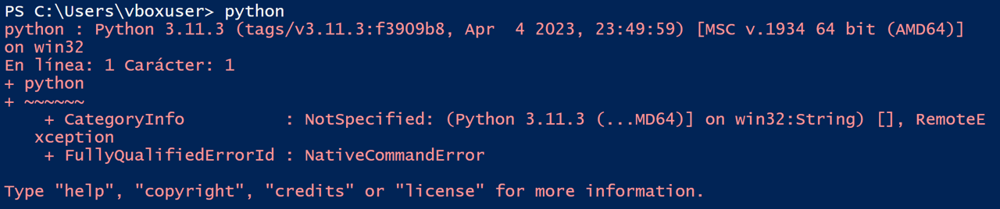

[Página principal](../README.md)

# FAQ 
## Windows PowerShell
### Cuando ejecuto el comando python para abrir la consola, marca un error por políticas de restricción. 
Debes eliminar las restricciones de ejecución con los siguientes pasos:
1. Ejecutar windows power shell como Administrador
2. ejecuta el comando `Set-ExecutionPolicy Unrestricted` 

### Cuando ejecuto el comando python para abrir la consola, se muestra el siguiente mensaje de error: 
  
Debes ejecutar el comando `start python`

