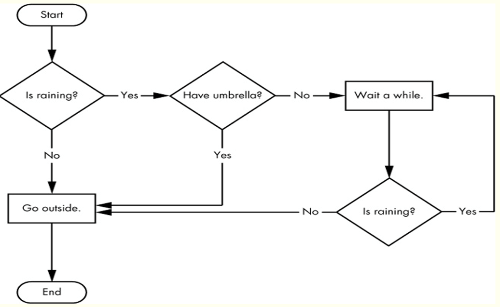
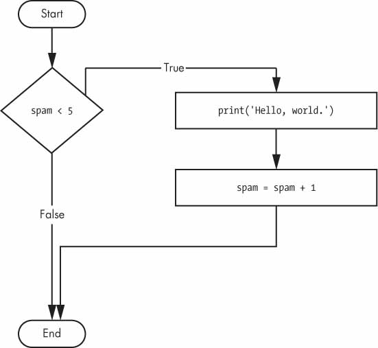
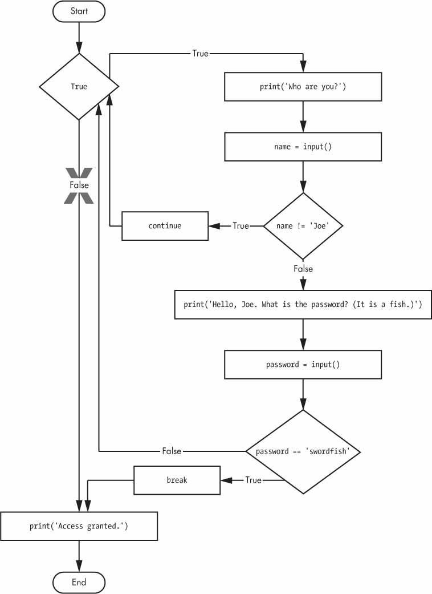

# Python - Ciclos
## Diagramas de flujo 


## While
### `while expression is true`  

```python
spam = 0
while spam < 5:
    print('Hello, world.')
    spam = spam + 1
```

### `while expression is true`


```python
name = ''
while name != 'your name':
    print('Please type your name.')
    name = input()
print('Thank you!')
```

### Break
La palabra `break` rompe el ciclo o bucle <br>


```python
while True:
    print('Please type your name.')
    name = input()
    if name == 'your name':
        break
    print("Again...")
print('Thank you!')
```

### Continue (continua con la siguiente iteración) 
La palabra `continue` rompe la iteración y pasa a evaluar la expresión <br>


```python
while True:
    print('Who are you?')
    name = input()
    if name != 'Joe':
        continue
    print('Hello, Joe. What is the password? (It is a fish.)')
    password = input()
    if password == 'swordfish':
        break
print('Access granted.')    
```

# for .. in .. range 
Generalmente, se asocia a un "contador"..<br> 


```python
print('My name is')
for i in range(5):
    print('Jimmy Five Times (' + str(i) + ')')
```

## Lo equivalente utilizando while
```python
print('My name is')
i = 0
while i < 5:
    print('Jimmy Five Times (' + str(i) + ')')
    i += 1
```

## No siempre empieza en cero y tampoco el incremento es de uno en uno

```python
for i in range(2, 12, 2):
    print(i)
```

```python
for i in range(20, 5, -3):
    print(i)
```

## Otro ejemplo
```python
import random
for i in range(5):
    print(random.randint(1, 10))
```

## Break & continue, funcionan igual que en el while 
¿Cuál es la salida del siguiente código? <br>
```python
for i in range(50):
    if i % 3 == 0:
        continue
    print(f"i = {i}")
    if i > 10:
        break
```


## Pruebas de escritorio 
```
Para el ejercicios anterior, cuál es el valor incial de i, cuál es el último valor de i?
```