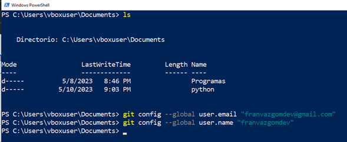
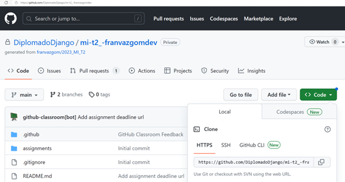
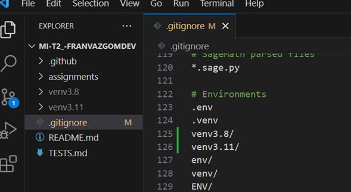

# Git - Comandos basicos
Github, un repositorio es un sitio centralizado donde se almacenan archivos informáticos. <br> 
Control de versiones – programa para la gestión de versiones. 
## Estructura
1. Directorio de trabajo
    * Contiene los archivos
2. Index  (add ->)
    * Actua como la zona intermedia
3.- HEAD
    * Apunta al último commit realizado 

## Verificación de instalación
```
git --version
```

## Configuraci[on de usuario]


## SSH - Autenticación 
Revisa los pasos a seguir de acuerdo con el sistema operativo que tengas instalado
[SSH - Doc](https://docs.github.com/es/authentication/connecting-to-github-with-ssh/generating-a-new-ssh-key-and-adding-it-to-the-ssh-agent)

### Pasos a seguir
+ Generar una clave SSH basada en llave pública y privada 
+ Iniciar el agente SSH 
+ Agregar la clave SSH al ssh-agent 
    + Indicar que se realice de manera automática
+ Prueba de conexión con github 
## Clonar repositorio
### Obtener el link de nuestro repositorio


```
git clone https.... 
```
## El archivo .gitignore


## ¿Cómo funciona? 
El repositorio local está compuesto por 3 árboles 
+ Directorio de trabajo
+ Index  (Stage)
+ Head  (Apunta al último commit realizado)

## Colocar un archivo en el Stage 
```
git add <ficher>
gitt add .      #Sube todo el contenido de la carpeta
git add -A      #Sube todo
```
## status 
```
git status
```

## Deshacer un que no se ha hecho commit
```
git restore <fichero>
```

## Commit 
```
git commit -m "Notas de los cambios para identificar mejor el cambio" 
```

## Deshacer un cambio
```
git reset -hard             #Deshace todos los cambios hasta el último commit 
git reset AHEAD <fichero>   #Deshace los cambios del fichero
```

## Push  (subir un cambio)
```
git push origin <rama>
ejemplo:  git push origin main 
```

## Pull  (Actualizar el repostorio local)
```
git push origin <rama>
ejemplo:  git push origin main 
```

## Referencias
[https://rogerdudler.github.io/git-guide/index.es.html](https://rogerdudler.github.io/git-guide/index.es.html) <br>
[https://docs.github.com/es/get-started/quickstart/hello-world](https://docs.github.com/es/get-started/quickstart/hello-world)


# Ejemplos
## Escenario1 
1.	Crear rama developer
    * git checkout -b developer
2.	Desarrollar la función “suma”
    * Se realiza el código para la funcionalidad solicitada
    * Se actualiza el repositorio
        * git add -A
        * git commit -m “comentarios.. “ 
        * git push origin developer 
3.	Se realiza merge de la rama principal con la rama developer
    * git checkout main
    * git merge developer
    * git push origin main
4.	Desarrollar la función resta, pero terminada. 
    * git checkout developer 
    * git add -A
    * git commit -m “comentarios.. “ 
    * git push origin developer 
5.	Cambiarse a la rama main, realizar una corrección de la llamada a la función suma
    * git checkout main
    * realizar los cambios
    * git add -A
    * git commit -m “comentarios.. “ 
    * git push origin main
6.	Regresar a developer y hacer un rebase
    * git checkout developer
    * git rebase main
    * terminar con el desarrollo pendiente
    * git add -A
    * git commit -m “comentarios.. “ 
    * git push origin developer
7.	Se realiza merge de la rama principal

## Escenario 2
1.	Regresar a una versión totalmente identificada como buena y apuntar el main ahí. 
2.	Ver el log de git
    * git log --oneline
3.	Colocar una etiqueta a la versión que se desea regresar
    * git tag v2.1 F44433  
4.	Cambiarse de rama
    * git checkout v2.1
5.	Actualizar el main
    * git branch -f main v2.1
    * git push -f origin v2.1:main
    * git checkout main
