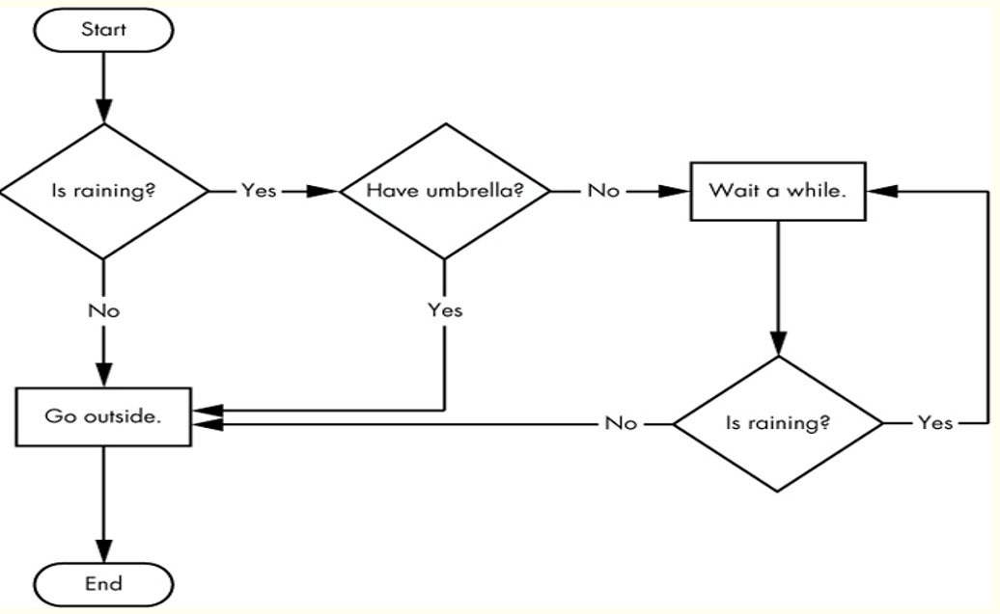
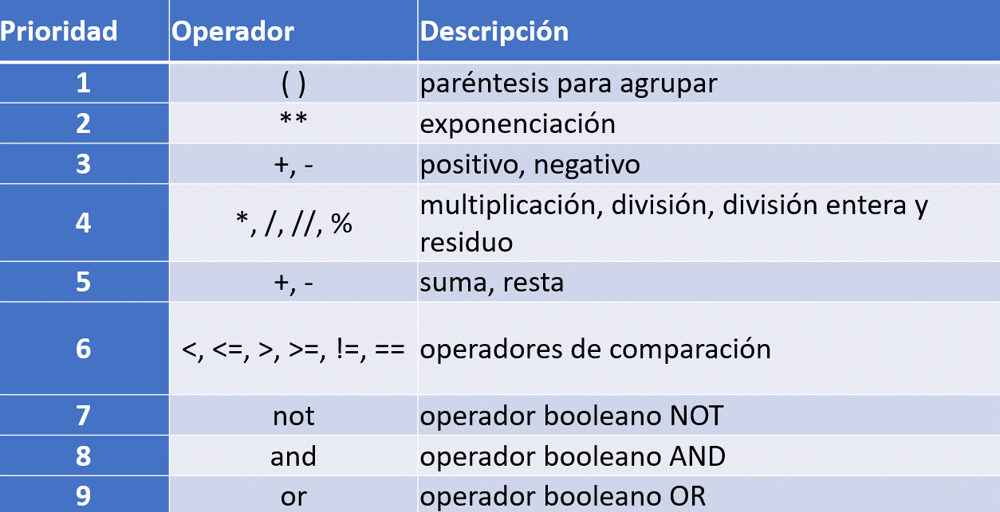
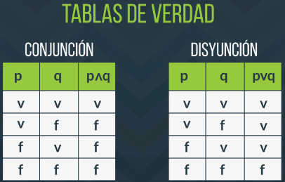
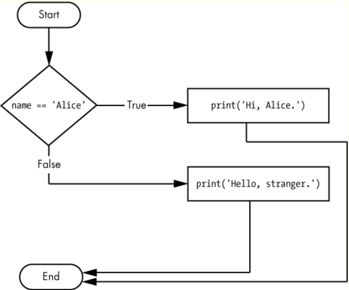
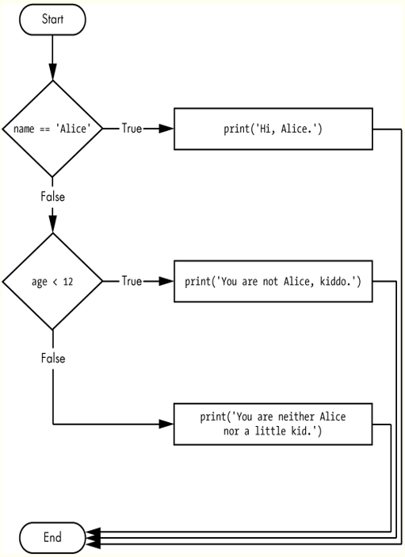
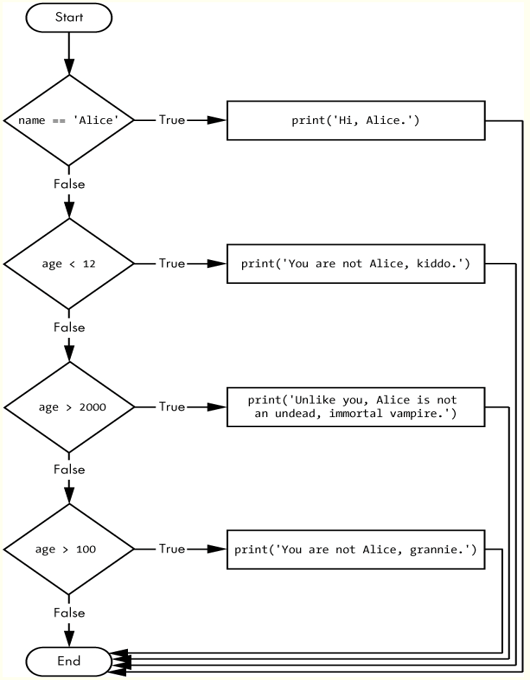

# Python - Sentencias de control

## Operadores de comparación y su precedencia

## Diagramas de flujo 


## Operadores y su precedencia


## Tablas de verdad del `and` y `or`


## Ejemplos de expresiones
```python
    >>> "Hola" == "hola"
    False
    >>> 34 > 12.5
    True
    >>> 12 <= 12
    True
    >>> not True
    False
    >>> 4 < 6 and 2 > 3 
    False
    >>> 4 < 6 or 2 > 3
    True
    >>> "desde" not in "Hola desde México"
    False
    >>> nombre = 'Juan'
    >>> edad = 21
    >>> nombre == 'Juan' and edad >= 18
    True
```


## Ejemplo If


```python
    if name == 'Alice':  
        print ("Hello Alice.")  # inicia un bloque, notar la indentación (sangría)
    else:
        print ("Hello stranger.)
```

## Bloques de código
Las líneas de código de python pueden ser agrupadas en bloques, las reglas de un bloque son: <br>
1. Un bloque inicia cuando la indentación crece
2. Un bloque puede contener otro bloque de código
3. Un bloque termina cuando la indentación decrece


## Ejemplo If (bloques)

```python
    if name == 'Alice':  
        print ("Hello Alice.")  # Inicia el bloque
        print ("Welcome")       # Fin del bloque
    # Observa que el `else` no es obligatorio 
    print("Hi!!!! ... ")        # Esta instrucción no es parte del bloque
```
## Ejemplo elif 



## Ejemplo elif complejo


### ¿El órden es importante?