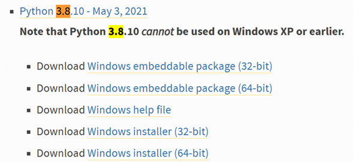

# Python - Versiones
## Instalar otras versiones
### Obtener el instalador


### Python 3.8 (Ejemplo)



### Ejecución de una versión particular
En el PATH puedes ubicar la ruta del archivo binario (ejecutable)<br>


## Crear un entorno virtual 


```python
# Ejemplo  
python -m venv venv
```


### Activación del entorno virtual 
### Windows
`venv\Scripts\activate`

### MacOS / Linux
`source venv/bin/activate`

### Desactivar entorno virtual
`deactivate`


