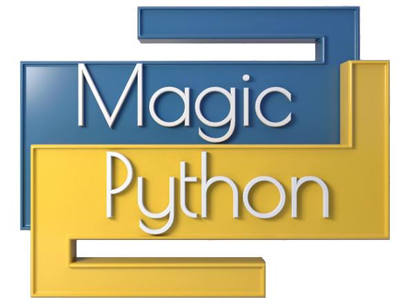

# Repaso, hasta ahora ¿qué hemos aprendido? 
* Programación
    - Consola
    - Sintaxis de python
    - Ejecución de un programa
    - Operadores: + - / // * % **
        - Precedencia
    - print
    - comentarios
    - Variables
        - Tipos de datos: int, str, float, bool
        - Tipado dinámico 
        - Casting
    - Libería math: floor, ceil, comb, factorial, gcd, log
    - Buena práctica: funcion main
    - String: List, sublista, len, replace, lower, upper, isupper, islower

* Herramientas (Instalación)
    - Python
    - Visual Studio code
    - Git
# Python - Strings 
## String - formato f
Revisar el prefijo f o F <br>
Ver `code\Modulo-I\ejercicios\03_Print.py`

## String - funciones
* La función `print()` se utiliza para pintar el texto de la cadena

### String = Lista de caracteres
```python
x = 'Python' 
print(x[2]) # ==> t  - Observa que las posiciones en la lista empiezan en CERO 
```

### String = Slicing
```python
x = 'Python es lo mejor' 
print(x[4:8]) # ==> on e  - Observa que el límite inferior se incluye, sin embargo, el límite superior no
print(x[:3]) # ==> Pyt 
```

### String len 
```python
x = 'Python' 
print(len(x)) # ==> 6 
```

### String strip 
```python
x = '  Python es lo mejor  ' 
print(x.strip()) # ==> Python es lo mejor
```

### String replace 
```python
x = 'Python es lo mejor' 
print(x.replace('o','x')) # ==> Pythxn es lo mejxr
print(x) # Observa que la variable x, NO fue modificada 
```

### String Otras funciones
* lower()
* upper()
* isupper()
* islower()

## Caracteres de escape
```python
\'      # Comilla simple 
\"      # Comilla doble
\t      # Tabulador
\n      # Nueva línea
\\      # Backsalsh 

#Ejemplos: 
print ("Hola, \n¿Cómo estas?\nYo estoy \"muy bien!!\" ")
```

## Raw string
Colocar un `r` antes de las comillas de un string `"` crea un `raw string` <br>
Un `raw string` ignora completamente los caracteres de escape. 

```python 
cadena = r'Hola \'Mundo \n Saludos. '
print (cadena)
```
Muestra 
```
Hola \'Mundo \n Saludos.
```
## Operadores: in, not in 
```python 
>>> "ola" in "Hola Mexico"
True

>>> "ola" not in "Hola Mexico"
False
```

## String mas funciones
* startswith()
* endswith()

```python 
>>> x = "Hola Mexico"
>>> x.startswith("Hola")
True
```

## Split & Join
### Split
```python
>>> original = "Hola México, Felicidades!!"
>>> x = original.split()    # El split lo realiza con el espacio en blanco (default)
>>> x
['Hola', 'México,', 'Felicidades!!']


>>> x = original.split(",") # El split lo realiza con la ,  
>>> x
['Hola México', ' Felicidades!!']
```

### Join
```python
>>> x = ['Hola', 'Mexico,', 'Felcidades!!']
>>> cad = ' '.join(x)
>>> cad
'Hola Mexico, Felcidades!!'
>>> cad = 'ABC'.join(x)
>>> cad
'HolaABCMexico,ABCFelcidades!!'
```

### Justify, rjust, ljust, center
```python
>>> "Hola".rjust(15)
'           Hola'

>>> "Hola".ljust(10)
'Hola      '
>>> "Hola".center(15)
'      Hola     '
>>> "Hola".center(15,'*') 
'******Hola*****'
```

### Remover espacios en blanco
```python
>>> cad = '    Hola México     '
>>> cad.strip()
'Hola México'
>>> cad
'    Hola México     '
>>> cad.lstrip()
'Hola México     '
>>> cad.rstrip()
'    Hola México'
```
