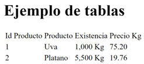
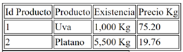
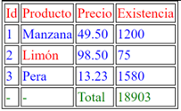
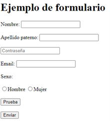

# Prácticas

# Tabla de contenido
1. [Practica 1 - Generales](#practica1)
2. [Practica 2 - Tablas](#practica2)
3. [Practica 3 - Formulario](#practica3)

## Práctica 1 - Generales <a name="practica1"></a>
1.	Crear el archivo 01_practica1.html
    * !
    * Colocar al menos 3 encabezados 
        * H1, H2, H3
    * Colocar 2 parrafos 
        * Verificar el shurtcut lorem * 2
2.	Verificar servidor
3.	Colocar 2 ligas hacia Google. 
    * target="_self"
        * https://www.google.com
        * target="_blank"
        * https://login.yahoo.com
4.	Colocar 5 BR entre cada párrafo
5.	Colocar un HR
6.	Colocar una imágen 
    * ``
<br>

## Práctica 2 - Tablas <a name="practica2"></a>
1.	https://www.w3schools.com/tags/tag_table.asp
2.	Crear el archivo 02_tablas.html
3.	Crear una tabla de 3 filas y 4 columnas
    * `<table`  
    * `tr*5`  
    * `td*3 <ctrl> + <alt> + flecha abajo   / <Opt> + <Cmd> +  flecha abajo || tr*3>td*4  `
    <br>
    
4.	Colocar un borde a cada celda (dentro del head, colocar el estilo)
<br>
    
<br>
```html
<style>
   table, th, td {
       border: 1px solid black;
   }
</style>

```
5.	Dentro del head, colocar los siguientes estilos
```html

<style>
   thead {color: green;} 
   tbody {color: blue;}
   tfoot {color: red;}

   table, th, td {
       border: 1px solid black;
   }
</style>
``` 
6.  Modificar la tabla
<br>
    
<br>
 
7.  Verificar el siguiente estilo con el ‘Inspect’ del navegador
<br>`<table style='width:80%;'> `
<br>

## Práctica 3 – Formularios <a name="practica3"></a>
1.	Crear el archivo 03_formulario.html
2.	Crear el siguiente formulario
<br>
    
<br>
    *   form. 
    *   <label 
    *   <input    value… 
    *   button
    *   text   placeholder
    *   radio  
    *   password
    *   email
    *   required=true 
    *   submit

