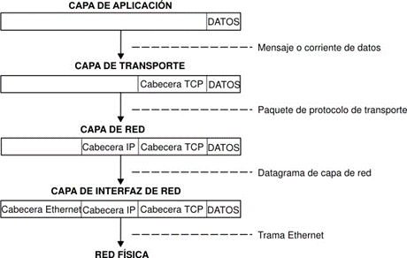

# Python - HTML5, CSS 3, JavaScript y JQuery

# Tabla de contenido
1. [Objetivos](#objectives)
2. [Extensiones](#extensiones)
3. [www](#www)
4. [html](#html)
4. [Definiciones asociadas](#def_asociadas)


## Objetivos <a name="objectives"></a>
Comprender y aplicar los conceptos de usabilidad, UX y accesibilidad, con el fin de poder crear sitios web que puedan interactuar dinámicamente con la manipulación del DOM (Document Objecto Model) del HTML.    

## Extensiones Visual Studio Code <a name="entensiones"></a>
* HTML Snippets
* Live Server
* Prettier Code Formatter
* Bracket pair colorization Toggler
* vscode-icons
* HTML CSS Support
* IntelliSense for CSS clasnames in HTML
* Verificar
    * JSON File
    ```json
    "html.suggest.html5": true,
    "editor.linkedEditing": true,
    "emmet.triggerExpansionOnTab": true,
    ```
# WWW World Wide Web  (WWW)  <a name="www"></a> 
Timothy "Tim" John Berners-Lee (Londres, Reino Unido, 8 de junio de 1955), es un científico de la computación británico, conocido por ser el padre de la World Wide Web. Estableció la primera comunicación entre un cliente y un servidor usando el protocolo HTTP en diciembre de 1990. En octubre de 1994 fundó el Consorcio de la World Wide Web (W3C) con sede en el MIT, para supervisar y estandarizar el desarrollo de las tecnologías sobre las que se fundamenta la Web y que permiten el funcionamiento de Internet. <br>
* W3C – Consorcio internacional que genera recomendaciones y estándares. (desde 1994) 
* https://www.w3.org/ 
* Asegura el crecimiento de la WWW a largo plazo

# HTML (HyperText Markup Language) <a name="html"></a>
## https://www.w3.org/TR/html52/introduction.html#background

Es un “Lenguaje” basado en “Marcas” y “Jerarquías”, un documento HTML se conoce como un DOM (Document Object Model) 
## Arbol de componentes
## HTML – Referencia 
### https://www.w3schools.com/tags/default.asp

## Deficiones asociadas <a name="def_asociadas"></a>
### URL (Uniform Resource Locator) 
Es la dirección única y específica que se asigna a cada uno de los recursos disponibles de la World Wide Web para que puedan ser localizados por el navegador y visitados por los usuarios

### HTTP ( HyperText Transfer Protocol) 
Protocolo de Transferencia de Hipertexto en español, es un protocolo de la capa de aplicación para la transmisión de documentos hipermedia, como HTML. Fue diseñado para la comunicación entre los navegadores y servidores web. 

### TCP-IP (Transfer Control Protocol – Internet Protocol)  1969 -  Protocolo estándar para Internet. 
TCP/IP define cuidadosamente cómo se mueve la información desde el remitente hasta el destinatario. En primer lugar, los programas de aplicación envían mensajes o corrientes de datos a uno de los protocolos de la capa de transporte de Internet, UDP (User Datagram Protocol) o TCP (Transmission Control Protocolo). Estos protocolos reciben los datos de la aplicación, los dividen en partes más pequeñas llamadas paquetes, añaden una dirección de destino y, a continuación, pasan los paquetes a la siguiente capa de protocolo, la capa de red de Internet.
La capa de red de Internet pone el paquete en un datagrama de IP (Internet Protocol), pone la cabecera y la cola de datagrama, decide dónde enviar el datagrama (directamente a un destino o a una pasarela) y pasa el datagrama a la capa de interfaz de red. <br>
La capa de interfaz de red acepta los datagramas IP y los transmite como tramas a través de un hardware de red específico, por ejemplo redes Ethernet o de Red en anillo.


<br>


# Meta-tags
```html
<meta charset="UTF-8">
<meta name="viewport" content="width=device-width, initial-scale=1.0">
```

   
## Ver documentación
https://www.w3schools.com/tags/tag_meta.asp


